# Miu Shop
[](https://github.com/hardingadonis/miu-shop/actions/workflows/build.yml)
[](https://github.com/hardingadonis/miu-shop/actions/workflows/publish.yml)
[](https://github.com/hardingadonis/miu-shop/actions/workflows/release.yml)
[](https://www.codefactor.io/repository/github/hardingadonis/miu-shop)


> Miu Shop is a website that sells M.O.I cosmetics that are written in Java.


## Requirements
- JDK 8
- MySQL 8.1.0
- Tomcat 8.5
- Maven 3+


## Database
<details>
  <summary>Database</summary>

  <div style="margin-top: 20px">
    <a href="https://github.com/hardingadonis/miu-shop">
      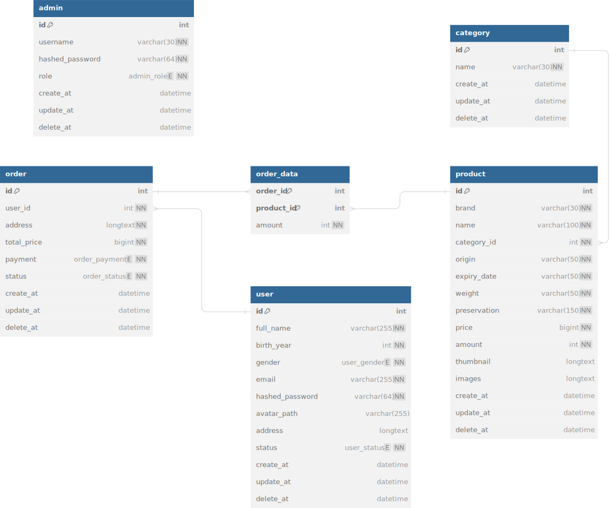
    </a>
  </div>
</details>


## Preview
<details>
  <summary>User page</summary>

  <div style="margin-top: 20px">
    <a href="https://github.com/hardingadonis/miu-shop">
      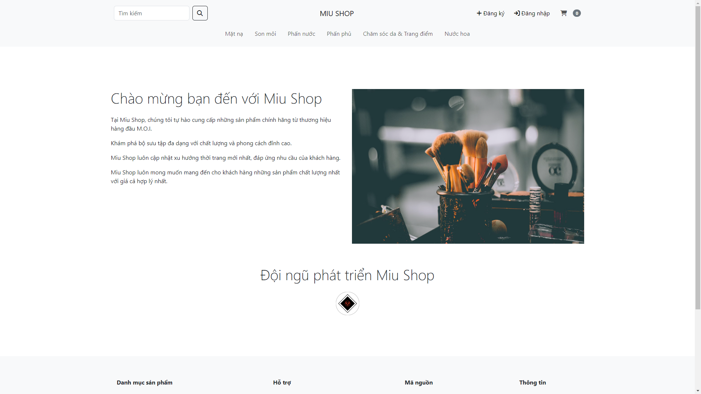
    </a>
    <a href="https://github.com/hardingadonis/miu-shop">
      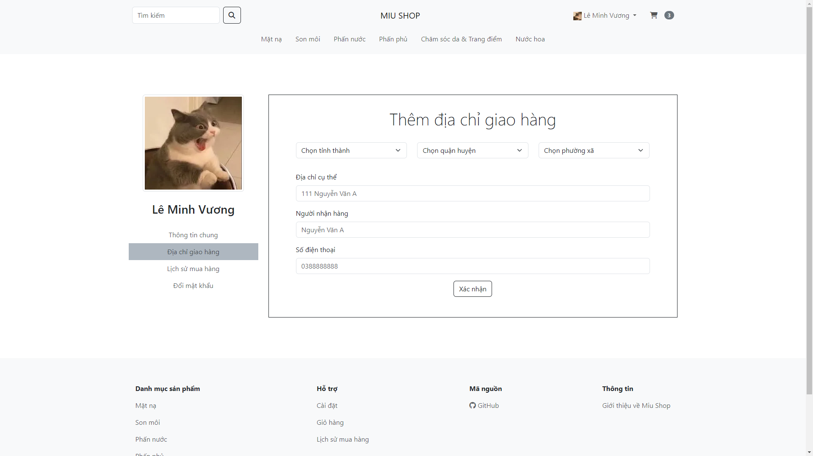
    </a>
    <a href="https://github.com/hardingadonis/miu-shop">
      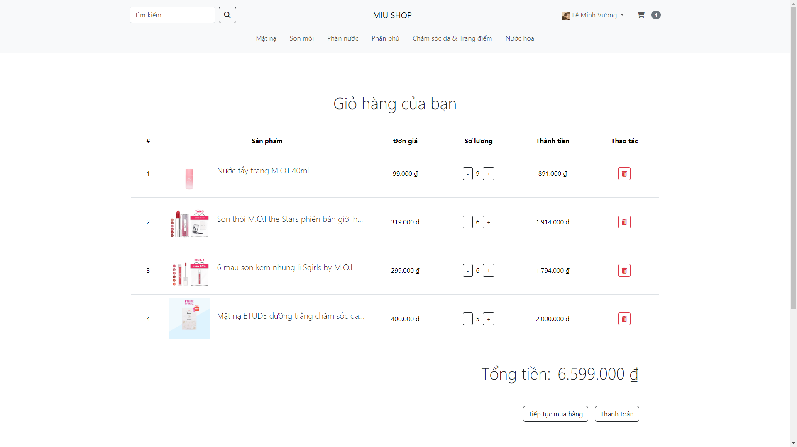
    </a>
    <a href="https://github.com/hardingadonis/miu-shop">
      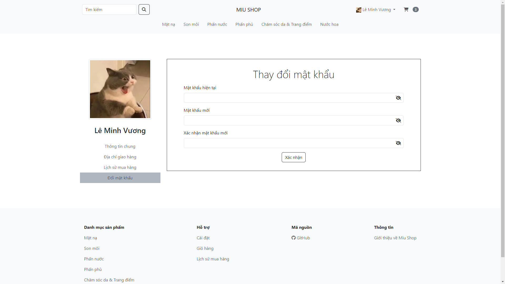
    </a>
    <a href="https://github.com/hardingadonis/miu-shop">
      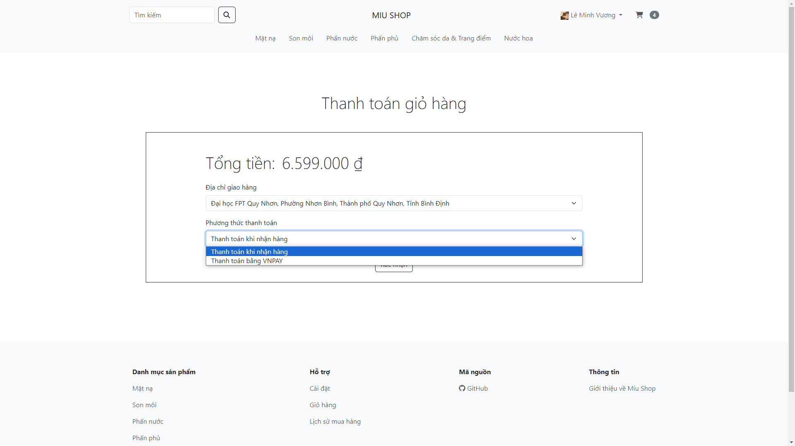
    </a>
    <a href="https://github.com/hardingadonis/miu-shop">
      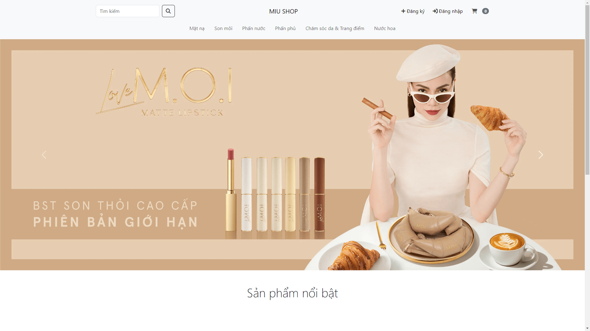
    </a>
    <a href="https://github.com/hardingadonis/miu-shop">
      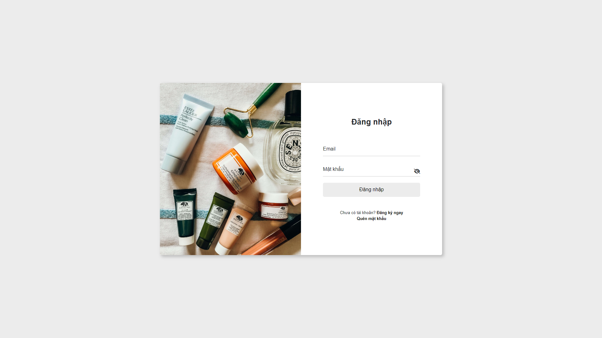
    </a>
    <a href="https://github.com/hardingadonis/miu-shop">
      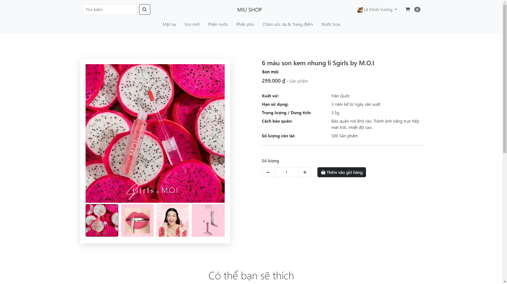
    </a>
    <a href="https://github.com/hardingadonis/miu-shop">
      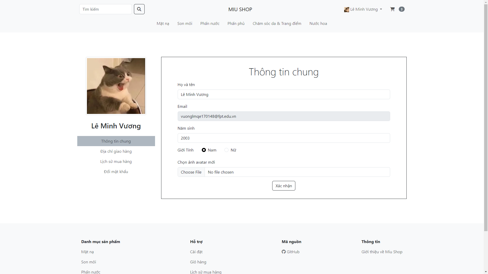
    </a>
    <a href="https://github.com/hardingadonis/miu-shop">
      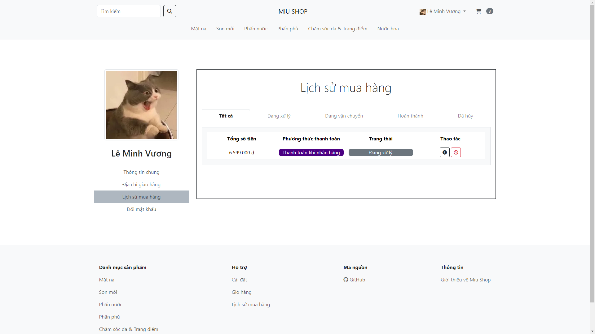
    </a>
    <a href="https://github.com/hardingadonis/miu-shop">
      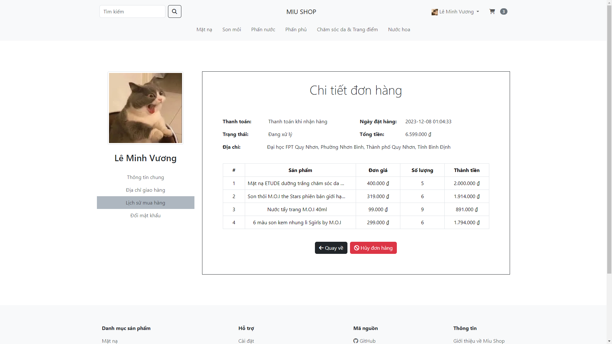
    </a>
    <a href="https://github.com/hardingadonis/miu-shop">
      
    </a>
    <a href="https://github.com/hardingadonis/miu-shop">
      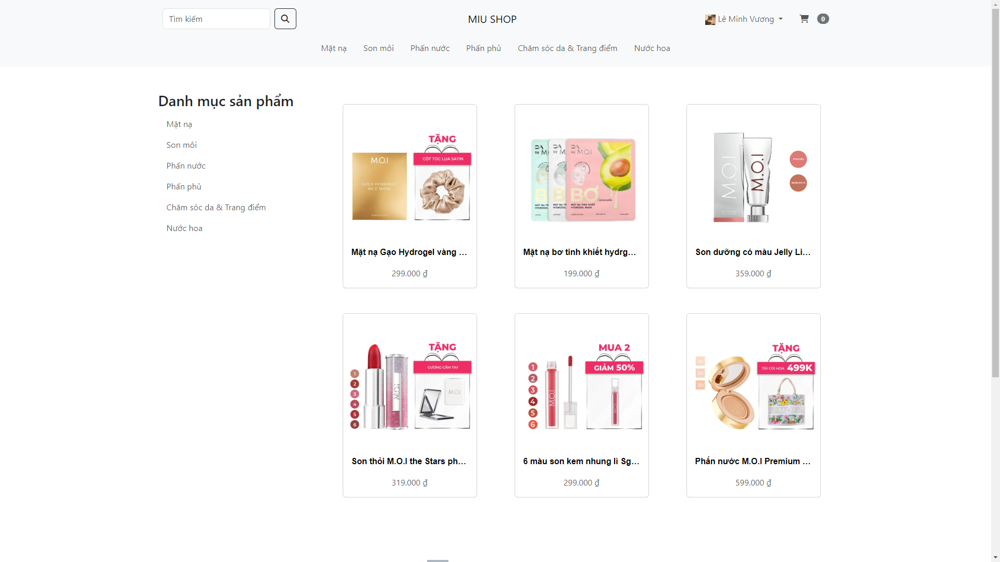
    </a>
    <a href="https://github.com/hardingadonis/miu-shop">
      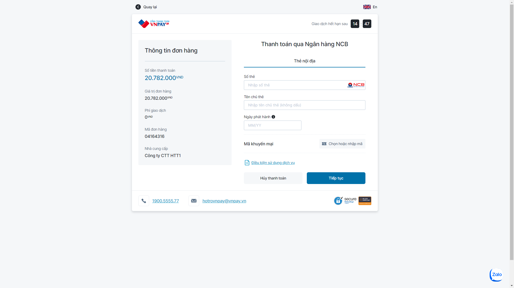
    </a>
  </div>
</details>
<details>
  <summary>Admin page</summary>

  <div style="margin-top: 20px">
  <a href="https://github.com/hardingadonis/miu-shop">
      
  </a>
  </div>
</details>

## Deployment
### Download `docker-compose.yml`:
```bash
curl -O https://raw.githubusercontent.com/hardingadonis/miu-shop/main/docker-compose.yml
```
### Run `docker-copmose`:
```bash
docker-compose up -d --build --force-recreate --remove-orphans --project-name miu
```
### Access `Miu Shop`:
- Open `http://localhost:80` in your browser.

## Contributors:

<a href="https://github.com/hardingadonis/miu-shop/graphs/contributors">
  
</a>


## Licenses:
- [Miu Shop](https://github.com/hardingadonis/miu-shop) is under the [Apache-2.0 license](https://github.com/hardingadonis/miu-shop/blob/main/LICENSE).
- [location_data.json](https://raw.githubusercontent.com/hardingadonis/miu-shop/main/database/location_data.json) is collected by [DiaGioiHanhChinhVN](https://github.com/kenzouno1/DiaGioiHanhChinhVN).
- [favicon](https://github.com/hardingadonis/miu-shop/blob/main/src/main/webapp/assets/images/favicon/favicon.png) is under the [flaticon](https://www.flaticon.com/free-icon/cosmetics_3194619).
- [male](https://github.com/hardingadonis/miu-shop/blob/main/src/main/webapp/assets/images/avatars/male.webp) is under the [flaticon](https://www.flaticon.com/free-icon/man_3741578).
- [female](https://github.com/hardingadonis/miu-shop/blob/main/src/main/webapp/assets/images/avatars/female.webp) is under the [flaticon](https://www.flaticon.com/free-icon/woman_3741715).
- [Login Page Cover Image](https://unsplash.com/photos/white-and-orange-plastic-bottle-7tDGb3HrITg), [About Page Cover Image](https://unsplash.com/photos/assorted-make-up-brushes-closed-up-photography-pxax5WuM7eY) are under the [Unsplash License](https://unsplash.com/license).